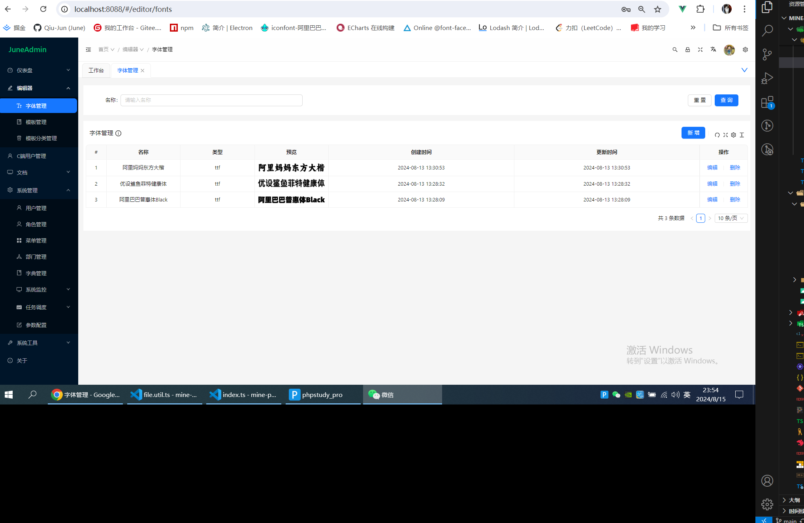

<!--
 * @Description: md
 * @Author: June
 * @Date: 2024-04-24 09:32:13
 * @FilePath: \mobile-fabric-editor\README.md
 * @LastEditTime: 2024-08-26 20:40:55
 * @LastEditors: June
-->

## mobile-fabric-editor

`mobile-fabric-editor`是基于fabric的移动端简易图片编辑器, 开源版本仅有编辑器，非开源版本附带后台管理(`非开源版本，除了附带后台管理外，代码也比开源版本更优雅`)，区别如下。<br />
|           | 编辑器  |  小程序  |    后台   |
|   --      | --      |   --     |   --     |
| 开源版    |     √   |    ×     |    ×      |
| 非开源版  |     √   |    √     |    √      |

## 本人与[yft作者](https://github.com/more-strive)支持各种软件定制开发， 欢迎联系。

+ [编辑器ai功能预览，编辑器可以点击体验地址](https://www.xiaohongshu.com/discovery/item/66cb510c000000001f015818?app_platform=ios&app_version=8.50.1&share_from_user_hidden=true&xsec_source=app_share&type=video&xsec_token=CBKPm6Xe0y0EyYcujWsjQzwH7BDRSu1mvEIAnV97RNzfU=&author_share=1&xhsshare=CopyLink&shareRedId=ODk0NUg9PEo2NzUyOTgwNjg2OTpHSEpK&apptime=1724656491&share_id=10b97c21d4cc4044b423b7c214829178)

+ 管理后台


#### 技术栈
- H5编辑器
  - Vue3
  - Typescript
  - uniapp
  - ai抠图(不开源)
  - ai修复图片(不开源)
- 后台(不开源)
  - Vue3
  - Typescript
  - ant design vue
- 服务端(不开源)
  - nest
  - mysql

#### 使用

```bash
# 如果没有pnpm 项目使用pnpm，commit自动校验都是用pnpm,请使用pnpm启动项目
npm install pnpm -g
pnpm install
pnpm dev:h5

# 贡献代码必须使用pnpm commit 使用commit 规范
git add . # 添加需要提交的文件
pnpm commit # 使用此命令编写commit
```

## 管理员

<!-- readme: collaborators -start -->
<table>
<tr>
    <td align="center">
        <a href="https://github.com/Qiu-Jun">
            
            <br />
            <sub><b>Qiu-Jun</b></sub>
        </a>
    </td></tr>
</table>
<!-- readme: collaborators -end -->

## 贡献者

<!-- readme: contributors -start -->
<table>
<tr>
    <td align="center">
        <a href="https://github.com/Qiu-Jun">
            
            <br />
            <sub><b>Qiu-Jun</b></sub>
        </a>
    </td>
    <td align="center">
        <a href="https://github.com/nihaojob">
            
            <br />
            <sub><b>nihaojob</b></sub>
        </a>
    </td></tr>
</table>
<!-- readme: contributors -end -->
